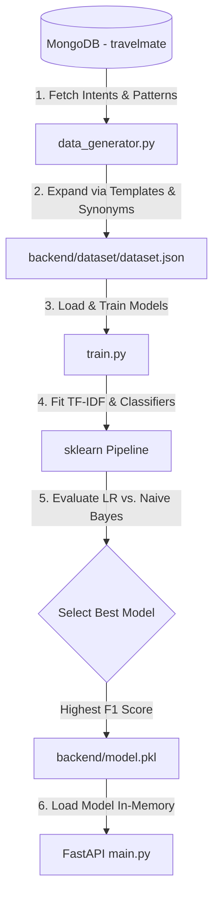

# TravelMate AI - Model Retraining Pipeline Guide

This guide details the pipeline and instructions to retrain the TravelMate AI natural language intent classification model.

---

## 🔄 Retraining Architecture & Data Flow

The TravelMate AI model utilizes an online-only database-driven dataset pipeline. The flow of data during a retraining run is illustrated below:



---

## 🛠️ How to Retrain the Model

There are two primary methods to retrain the machine learning model:

### Method 1: Via the Admin Dashboard UI (Recommended)
1. Ensure the backend FastAPI server and MongoDB are running.
2. Open the Admin Dashboard in your browser (`http://localhost:5173/admin`).
3. Click the **Model Performance** tab.
4. Click the **Retrain Model** button.
5. The frontend will invoke `POST /api/retrain`, which triggers the pipeline and reloads the new weights in-memory immediately.

### Method 2: Manual CLI Retraining
If you want to run the pipeline manually via terminal:

1. **Activate the Environment:**
   ```bash
   conda activate travelmate
   ```
2. **Generate the Dataset from MongoDB:**
   ```bash
   python backend/data_generator.py
   ```
   *This script fetches patterns from MongoDB, applies synonym maps/expansion templates, and saves the balanced dataset to `backend/dataset/dataset.json`.*

3. **Train and Select the Best Classifier:**
   ```bash
   python backend/train.py
   ```
   *This trains Logistic Regression and Multinomial Naive Bayes models on a stratified 80:20 split, compares their F1 scores, saves the winner as `backend/model.pkl`, and exports evaluation plots to `backend/reports/`.*

4. **Restart Backend Server (if not running dev server):**
   *If you are running the FastAPI backend locally, it will reload model weights on the next startup. If using the live dev server, call the retraining endpoint or restart it to apply.*

---

## 📁 Key Files & Outputs

*   **`backend/utils/db.py`**: Manages the database connection and seeds initial intents/packages if collections are empty.
*   **`backend/data_generator.py`**: Extracts raw intents and patterns from MongoDB, expanding them using natural language templates.
*   **`backend/train.py`**: Performs stratified model selection. Outputs:
    *   `backend/model.pkl`: The serialized winner model.
    *   `backend/reports/classification_report.json`: Precision, recall, and support numbers per intent.
    *   `backend/reports/model_comparison.json`: Benchmark metrics comparing Logistic Regression vs. Naive Bayes.
    *   `backend/reports/confusion_matrix.png`: Heatmap demonstrating classifier prediction overlaps.
    *   `backend/reports/intent_distribution.png`: Visual distribution of dataset samples.

---

## 📝 Guidelines for Adding New Intents or Patterns

When modifying intents in MongoDB (using the Admin Dashboard or direct DB updates):
1. **Diverse Patterns**: Provide at least 5-10 distinct user query patterns for any new intent.
2. **Stopwords Preservation**: The custom tokenizer does *not* filter out stopwords like "who", "are", "you" to ensure short queries resolve with high confidence. Keep patterns natural and conversational.
3. **Trigger Words**: If a pattern uses specific keywords (e.g., "beach", "safari"), ensure they map appropriately or are included in the pattern list to train features correctly.
4. **Retrain Post-Change**: Always trigger a retraining run after making modifications to MongoDB collections for the chatbot to recognize the updates.
